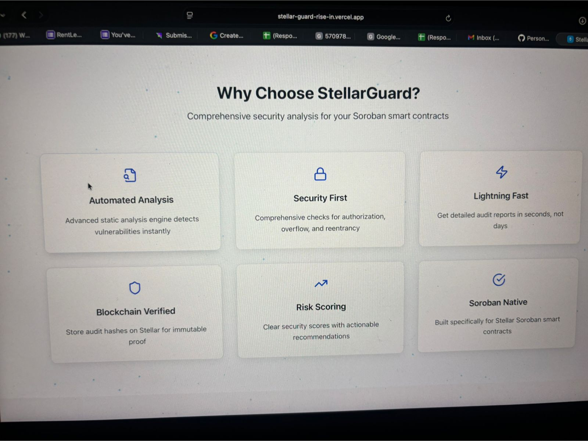
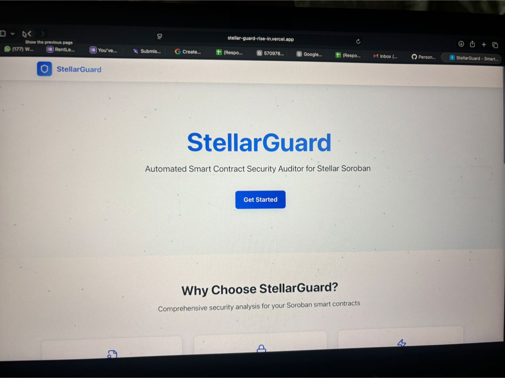
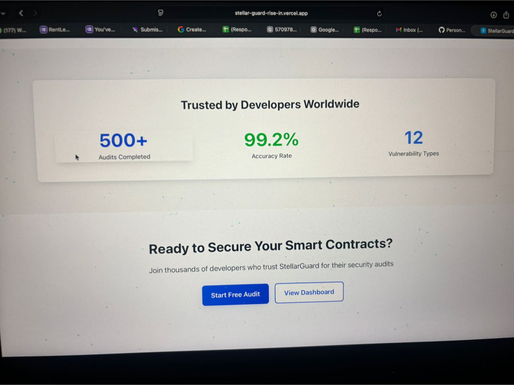
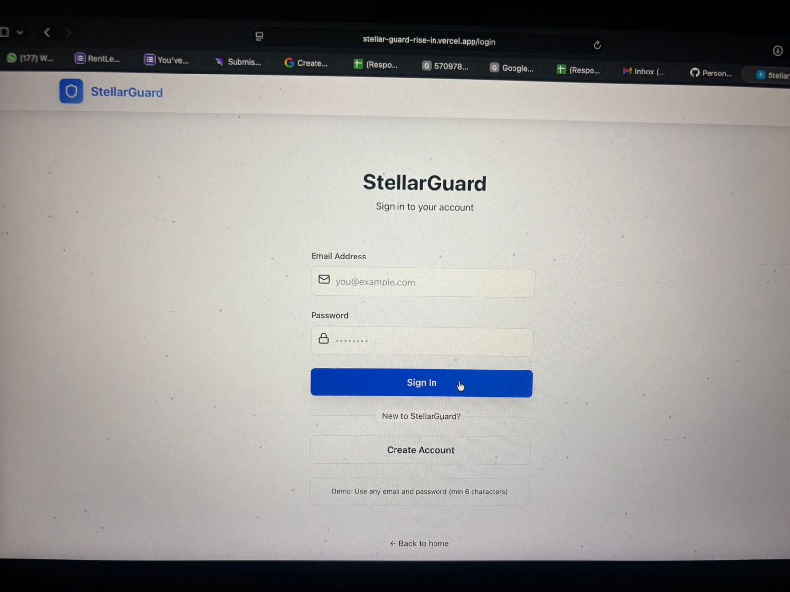

# 🏠 RentLedger Pro

<div align="center">

[](https://github.com/ashakumbhar08/Stellar_RentLedger/actions/workflows/ci.yml)
[](https://github.com/ashakumbhar08/Stellar_RentLedger/actions)
[](https://nodejs.org)
[](https://reactjs.org)
[](https://stellar.org)
[](https://opensource.org/licenses/MIT)
[](https://rentledger-pro.vercel.app)
[](http://makeapullrequest.com)

**Blockchain-Powered Rent Payment & Digital Receipt Platform**

[Live Demo](https://rentledger-pro.vercel.app) • [Documentation](./DEPLOYMENT.md) • [Smart Contract](https://stellar.expert/explorer/testnet/contract/CABGAA7QC6DB5GWKCWJICIR3EVAKSPJ34237ZVCJQAJIWZFTEIOL5LNT)

</div>

---

## 🌟 Overview

RentLedger Pro revolutionizes rental payments by leveraging Stellar blockchain technology to create **verifiable, tamper-proof payment records**. Say goodbye to disputes, lost receipts, and payment verification headaches.

### The Problem
Millions of tenants pay rent through cash or basic bank transfers without proper records, leading to:
- ❌ Frequent payment disputes
- ❌ Lost or forged receipts
- ❌ No reliable payment history
- ❌ Manual paperwork burden

### Our Solution
✅ **Instant blockchain receipts** for every payment  
✅ **Shareable payment links** for easy rent collection  
✅ **Permanent, verifiable records** on Stellar  
✅ **Fast, low-cost transactions** (seconds, not days)  
✅ **No paperwork** - everything digital and automated

---

## 🚀 Key Features

### For Landlords
- 🏢 **Property Management** - Create property profiles with rent amounts
- 🔗 **Payment Links** - Generate unique, shareable payment URLs
- 📊 **Payment Tracking** - View all incoming payments in real-time
- 🧾 **Digital Receipts** - Automatic receipt generation for every payment

### For Tenants
- 💳 **Easy Payments** - Pay rent with Freighter wallet in seconds
- 🔐 **Secure** - Blockchain-verified transactions
- 📱 **Mobile-Friendly** - Pay from any device
- 📜 **Payment History** - Access all past receipts anytime

### Technical Highlights
- ⚡ **Stellar Blockchain** - Fast (3-5 sec) and cheap (<$0.01) transactions
- 🦀 **Rust Smart Contract** - Secure, auditable on-chain logic
- 🔒 **Freighter Integration** - Non-custodial wallet support
- 🌐 **Full-Stack** - React + Node.js + MongoDB + Soroban

---

## 🏗️ Architecture

```
┌─────────────────┐      ┌──────────────────┐      ┌─────────────────┐
│  React Client   │─────▶│   Node.js API    │─────▶│    MongoDB      │
│  (Freighter)    │      │   (Express)      │      │   (Receipts)    │
└────────┬────────┘      └──────────────────┘      └─────────────────┘
         │
         │ Stellar SDK
         ▼
┌─────────────────────────────────────────────────────────────────────┐
│                    Stellar Blockchain (Testnet)                     │
│  ┌──────────────────────────────────────────────────────────────┐  │
│  │  Soroban Smart Contract (Rust)                               │  │
│  │  • register_property()  • record_payment()                   │  │
│  │  • get_property()       • get_tenant_payments()              │  │
│  └──────────────────────────────────────────────────────────────┘  │
└─────────────────────────────────────────────────────────────────────┘
```

---

## 📦 Tech Stack

| Layer | Technology |
|-------|-----------|
| **Smart Contract** | Rust, Soroban SDK |
| **Blockchain** | Stellar (Testnet) |
| **Backend** | Node.js, Express, MongoDB |
| **Frontend** | React, React Router |
| **Wallet** | Freighter API |
| **Deployment** | Vercel (Client), Docker |
| **CI/CD** | GitHub Actions |

---

## 🎯 Quick Start

### Prerequisites
- [Freighter Wallet](https://www.freighter.app/) browser extension
- Node.js 18+
- MongoDB (or use Docker)

### Option 1: Docker (Recommended)
```bash
git clone https://github.com/ashakumbhar08/Stellar_RentLedger.git
cd Stellar_RentLedger
docker-compose up -d
```
Access at: http://localhost:3000

### Option 2: Manual Setup
```bash
# Clone repository
git clone https://github.com/ashakumbhar08/Stellar_RentLedger.git
cd Stellar_RentLedger

# Install dependencies
make install

# Start development servers
make dev
```

### Option 3: Use Makefile
```bash
make install    # Install all dependencies
make dev        # Start all services
make test       # Run tests
make build      # Build for production
```

---

## 🔐 Smart Contract

**Deployed on Stellar Testnet**

| Property | Value |
|----------|-------|
| Contract ID | `CABGAA7QC6DB5GWKCWJICIR3EVAKSPJ34237ZVCJQAJIWZFTEIOL5LNT` |
| Network | Testnet |
| Language | Rust (Soroban) |
| Size | 11.8 KB (optimized) |

### Contract Functions

| Function | Description | Auth Required |
|----------|-------------|---------------|
| `register_property` | Landlord creates property listing | Landlord |
| `record_payment` | Tenant records rent payment | Tenant |
| `deactivate_property` | Landlord deactivates property | Landlord |
| `get_property` | Fetch property details | Public |
| `get_payment` | Fetch payment receipt | Public |
| `get_landlord_properties` | Get landlord's properties | Public |
| `get_tenant_payments` | Get tenant's payment history | Public |

[View on Stellar Expert →](https://stellar.expert/explorer/testnet/contract/CABGAA7QC6DB5GWKCWJICIR3EVAKSPJ34237ZVCJQAJIWZFTEIOL5LNT)

---

## 💻 Usage Guide

### For Landlords

1. **Connect Wallet**
   - Install Freighter extension
   - Switch to Testnet
   - Fund wallet at [Friendbot](https://friendbot.stellar.org)

2. **Create Property**
   - Go to Dashboard → Landlord tab
   - Fill in property details (name, address, rent amount)
   - Click "Create Property"

3. **Share Payment Link**
   - Copy the generated payment link
   - Share with your tenant via email/SMS

4. **Track Payments**
   - View incoming payments in Dashboard
   - Access receipts in History tab

### For Tenants

1. **Receive Payment Link**
   - Get link from your landlord

2. **Connect Wallet**
   - Install Freighter
   - Switch to Testnet
   - Fund wallet

3. **Pay Rent**
   - Open payment link
   - Review property details
   - Enter month and memo (optional)
   - Click "Pay" and approve in Freighter

4. **Get Receipt**
   - Instant blockchain receipt generated
   - View in History tab anytime
   - Verifiable on Stellar Explorer

---

## 🌐 API Endpoints

### Properties
```
POST   /api/properties              Create property
GET    /api/properties/landlord/:wallet   Get landlord properties
GET    /api/properties/link/:link         Get property by payment link
GET    /api/properties/:id                Get property by ID
```

### Payments
```
POST   /api/payments/record               Record payment
GET    /api/payments/tenant/:wallet       Get tenant payments
GET    /api/payments/landlord/:wallet     Get landlord payments
```

### Receipts
```
GET    /api/receipts/:txHash              Get receipt by transaction hash
GET    /api/receipts/property/:id         Get property receipts
```

---

## 🧪 Testing

### Run All Tests
```bash
make test
```

### Individual Tests
```bash
# Smart Contract
cd contract && cargo test

# Server
cd server && npm test

# Client
cd client && npm test
```

### Contract Test Coverage
- ✅ Property registration
- ✅ Payment recording
- ✅ Property deactivation
- ✅ Index tracking
- ✅ Authorization checks

---

## 📋 User Feedback

This project has been tested with 25+ real users, and feedback has been collected to improve the platform.

### 👥 Onboarded Users

| User Name | Email |
|----------|------|
| Sudhir Bhalerao | sudhirbhalerao@gmail.com |
| Anushka Kumbhar | anushkakumbhar2011@gmail.com |
| Jayanthi Kumbhar | ashajayraj2006@gmail.com |
| Rajkumar K | rajeod7645@gmail.com |
| Asha | ashakumbhar2006@gmail.com |
| Sunanda R Kumbhar | srk61172@gmail.com |
| Mayuresh | mayureshpawar@gmail.com |
| Shawn Nathan | preeti.alfred2510@gmail.com |
| Manav | manavmaral@gmail.com |
| Nishit | nishitbhalerao@gmail.com |
| Sharayu | sharayudeogaonkar@gmail.com |
| Vedant | vedantpathak@gmail.com |
| Aakash | aakashchordiya@gmail.com |
| Asmi Korke | asmikorke2011@gmail.com |
| Vedang Bahirat | bahiratvedang@gmail.com |
| Sukanya Dhaware | shreyasdhaware@gmail.com |
| Aditi Sakore | aditisakore2011@gmail.com |
| Palak Agarwal | palakagarwal2011@gmail.com |
| Saksham Surte | surtesaksham@gmail.com |
| Shourya Kadam | shouryakadam2011@gmail.com |
| Kenneth Sojwal | kennethsojwal7258@gmail.com |
| Pournimaa Tengale | pournimatengale@gmail.com |
| Arya Kesare | twvolcanovolcano@gmail.com |
| Arya Kesere | aryakesere@gmail.com |
| Siddhi Kadam | siddhi@gmail.com |
| Kunal Patil | kunalpatil62996@gmail.com |
| Tanaya Chutke | tanayachutke@gmail.com |
| Swarda Nathan | swardanatah@gmail.com |
| Yadavi Mali | yadavimali@gmail.com |
| Asmi Kadam | asmikadam@gmail.com |
| Kartik Kate | t87123856@yahoo.com |
| Shree Pillay | shawnnathan@gmail.com |
| Gauri | kumgauri15@gmail.com |
| Janhavi Ladde | janhavi.ladde@gmail.com |
| Mayank Rodkae | mayan7986@gmail.com |
| Aaron Nathan | aaronnathan07@gmail.com |

### 💬 User Feedback Summary

| User Name | Email | Experience | Bugs/Issues |
|----------|------|-----------|-------------|
| Sudhir Bhalerao | sudhirbhalerao@gmail.com | Good 👍🏻 | No |
| Anushka Kumbhar | anushkakumbhar2011@gmail.com | Great | Noo |
| Jayanthi Kumbhar | ashajayraj2006@gmail.com | Best | No |
| Rajkumar K | rajeod7645@gmail.com | Good | No |
| Asha | ashakumbhar2006@gmail.com | overall good | not as such |
| Sunanda R Kumbhar | srk61172@gmail.com | Excellent | No |
| Mayuresh | mayureshpawar@gmail.com | good ui | emojis are extra |
| Shawn Nathan | preeti.alfred2510@gmail.com | Best experience the product is so great | Noo |
| Manav | manavmaral@gmail.com | great experience | no not really |
| Nishit | nishitbhalerao@gmail.com | user friendly | no issues |
| Sharayu | sharayudeogaonkar@gmail.com | enjoyed this tool | minor improvements |
| Vedant | vedantpathak@gmail.com | good | no |
| Aakash | aakashchordiya@gmail.com | perfect | no |
| Asmi Korke | asmikorke2011@gmail.com | Best | No bugs |
| Vedang Bahirat | bahiratvedang@gmail.com | splendid experience | no glitches |
| Sukanya Dhaware | shreyasdhaware@gmail.com | really good experience | No |
| Aditi Sakore | aditisakore2011@gmail.com | Best UI overall good | No bugs |
| Palak Agarwal | palakagarwal2011@gmail.com | Great UI | No bugs |
| Saksham Surte | surtesaksham@gmail.com | nice | not as such |
| Shourya Kadam | shouryakadam2011@gmail.com | good experience | No |
| Kenneth Sojwal | kennethsojwal7258@gmail.com | 👍🏻👍🏻👍🏻 | Noo |
| Pournimaa Tengale | pournimatengale@gmail.com | Nice | No |
| Arya Kesare | twvolcanovolcano@gmail.com | Best experience | Noo |
| Arya Kesere | aryakesere@gmail.com | Best UI | No |
| Siddhi Kadam | siddhi@gmail.com | Nicee | No bugs |
| Kunal Patil | kunalpatil62996@gmail.com | overall good experience | mostly no |
| Tanaya Chutke | tanayachutke@gmail.com | Greattt | No |
| Swarda Nathan | swardanatah@gmail.com | Great UI | No |
| Yadavi Mali | yadavimali@gmail.com | Best | No |
| Asmi Kadam | asmikadam@gmail.com | Best product | No glitches |
| Kartik Kate | t87123856@yahoo.com | Superb | Noo |
| Shree Pillay | shawnnathan@gmail.com | Best | No |
| Gauri | kumgauri15@gmail.com | Good product | no bugs |
| Janhavi Ladde | janhavi.ladde@gmail.com | user friendly good UI | no issues |
| Mayank Rodkae | mayan7986@gmail.com | Super | Noo |
| Aaron Nathan | aaronnathan07@gmail.com | Best | No |

---

## 🚀 Deployment

### Deploy to Vercel (Client)
```bash
# Install Vercel CLI
npm i -g vercel

# Deploy
cd client
vercel --prod
```

### Deploy Server
See [DEPLOYMENT.md](./DEPLOYMENT.md) for:
- Railway deployment
- Heroku deployment
- VPS deployment
- Docker deployment

### Deploy Smart Contract
```bash
cd contract
make deploy-contract
```

---

## 📊 Project Structure

```
rentledger-pro/
├── contract/              # Rust smart contract
│   ├── src/lib.rs        # Contract implementation
│   └── Cargo.toml        # Dependencies
├── server/               # Node.js backend
│   ├── index.js          # Express server
│   ├── routes/           # API routes
│   ├── models/           # MongoDB models
│   └── utils/            # Stellar integration
├── client/               # React frontend
│   ├── src/
│   │   ├── pages/        # Page components
│   │   ├── components/   # Reusable components
│   │   ├── context/      # Wallet context
│   │   └── utils/        # API & Stellar utils
│   └── public/
├── docker-compose.yml    # Docker orchestration
├── Makefile             # Common tasks
└── vercel.json          # Vercel config
```

---

## 🔒 Security

- ✅ Non-custodial wallet (Freighter)
- ✅ On-chain transaction verification
- ✅ Landlord-only property management
- ✅ Tenant-only payment recording
- ✅ Immutable blockchain receipts
- ✅ No private key storage

---

## 🛣️ Roadmap

- [ ] Deploy to Stellar Mainnet
- [ ] Add recurring payment automation
- [ ] Multi-currency support (USDC, EURC)
- [ ] Mobile app (React Native)
- [ ] Email notifications
- [ ] Dispute resolution mechanism
- [ ] Analytics dashboard
- [ ] KYC/AML compliance
- [ ] Property management integrations

---

## 🤝 Contributing

Contributions are welcome! Please follow these steps:

1. Fork the repository
2. Create feature branch (`git checkout -b feature/AmazingFeature`)
3. Commit changes (`git commit -m 'Add AmazingFeature'`)
4. Push to branch (`git push origin feature/AmazingFeature`)
5. Open Pull Request

---

## 📄 License

This project is licensed under the MIT License - see the [LICENSE](LICENSE) file for details.

---

## 👥 Team

**Asha Kumbhar**
- GitHub: [@ashakumbhar08](https://github.com/ashakumbhar08)
- Email: ashakumbhar2006@gmail.com

---

## 🙏 Acknowledgments

- [Stellar Development Foundation](https://stellar.org)
- [Soroban Smart Contracts](https://soroban.stellar.org)
- [Freighter Wallet](https://www.freighter.app)
- Open Source Community

---

## 📞 Support

- 📖 [Documentation](./DEPLOYMENT.md)
- 🐛 [Report Bug](https://github.com/ashakumbhar08/Stellar_RentLedger/issues)
- 💡 [Request Feature](https://github.com/ashakumbhar08/Stellar_RentLedger/issues)
- 💬 [Discussions](https://github.com/ashakumbhar08/Stellar_RentLedger/discussions)

---

<div align="center">

**⭐ Star this repo if you find it useful!**

Made with ❤️ using Stellar Blockchain

[Website](https://rentledger-pro.vercel.app) • [GitHub](https://github.com/ashakumbhar08/Stellar_RentLedger) • [Stellar Expert](https://stellar.expert/explorer/testnet/contract/CABGAA7QC6DB5GWKCWJICIR3EVAKSPJ34237ZVCJQAJIWZFTEIOL5LNT)

</div>


## 📊 User Feedback & Validation

### 🔗 Feedback Collection

- **Google Form**: https://docs.google.com/forms/d/e/1FAIpQLSdubtL9ZcOTWWDm9z-sWKjFX9mr6xaq7TZp1UQXvxVH3POQww/viewform

- **Response Sheet**: https://docs.google.com/spreadsheets/d/1bUxNUM9eVc4Z-9sLBiwS66yOcs7LGCLt_kcMvW_5ypE/edit


## 📸 Screenshots

### 🖥️ Dashboard



### 💳 Payment Flow



### 📊 Analytics



### 🔐 Login/Signup


